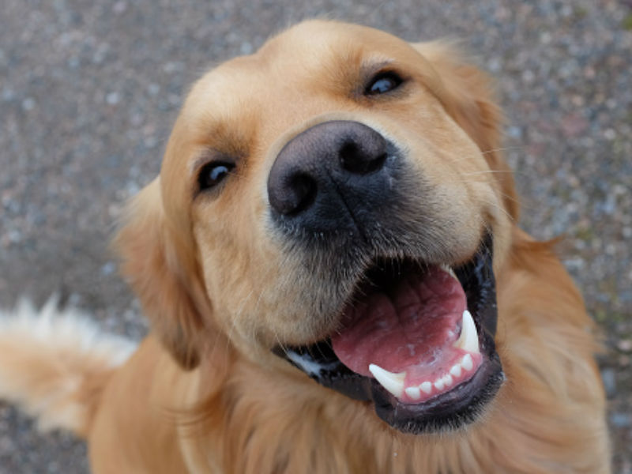
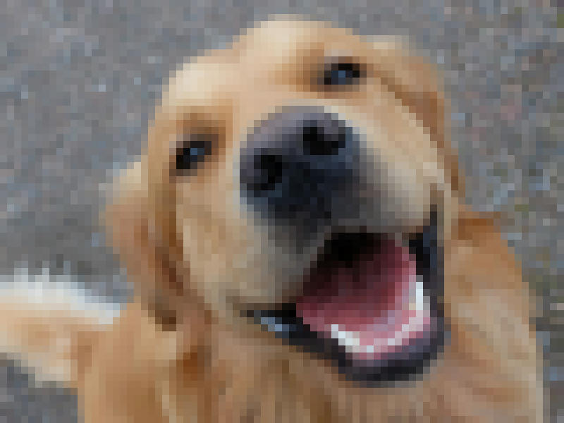

## Pixelate

Will pixel an input imagge

```
cargo run {input_image} {output_image}
```
If no input is set the default dog.jpg will be used. Default output file will be out.jpg

### Example
```
cargo run dog.jpg out.jpg
```
# Input


# Output

